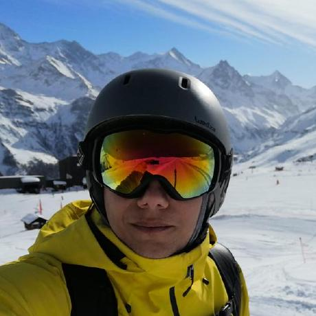
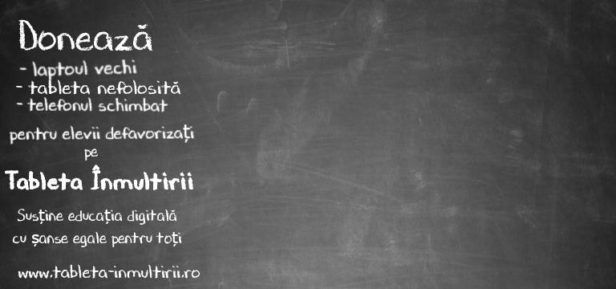
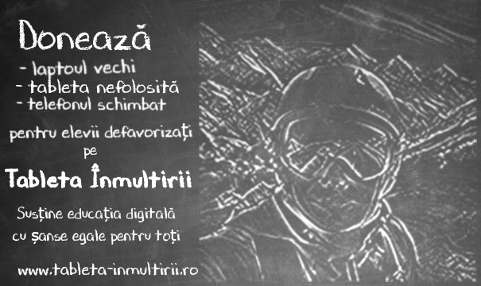

# image-processing-chalk-blackboard
Image processing to transform an image into a chalk drawing on a blackboard using `OpenCV`

## Example 

It works best with a blackboard background

Original Image | Background | Result 
--- | --- | ---
 |  | 

**Example as AWS Lambda (with OpenCV layer) with advanced features in [another repository](https://github.com/raducrs/tableta-inmultirii-aws-lambda/tree/main/imageprocessing/TI-ImageChalk)** 
